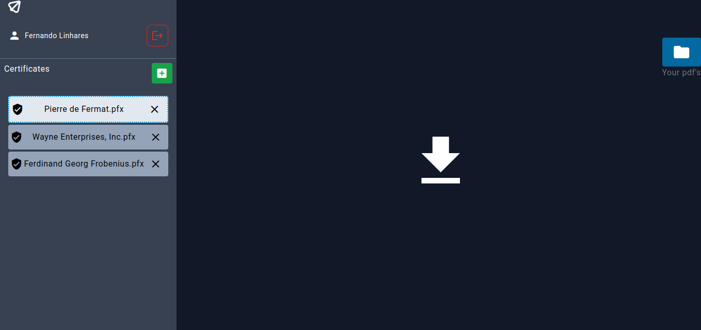
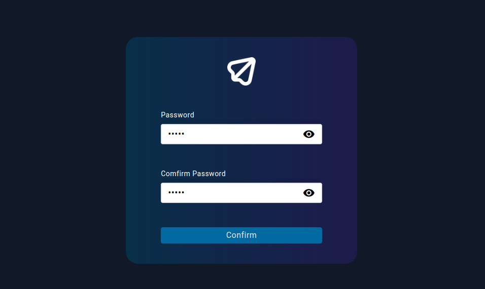
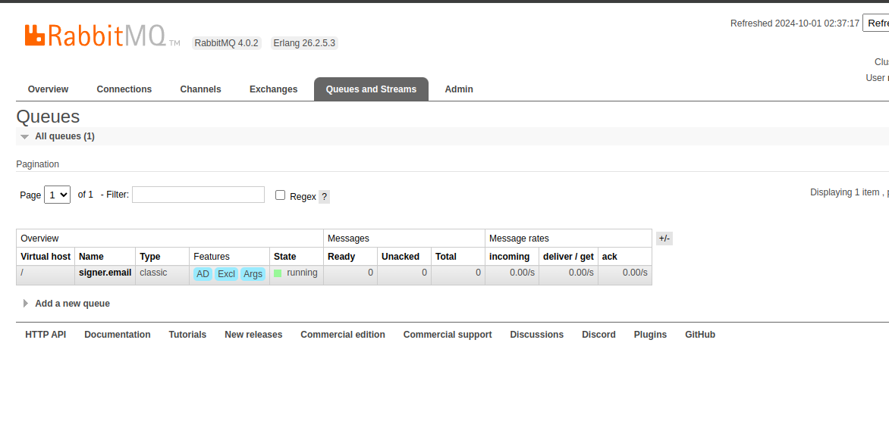

# WebSigner

## Overview

Websigner is a web system to make digital signature in the web context application
its can be a good system to store certificates and sign documents. Below you can see the steps to instalation and usage.

### Using RabbitMQ for emails

## Instalation

Install project cloning repository

	mkdir app
	cd app
	git clone https://github.com/Fernando-Linhares/websigner .

Setup project configurations

	sh ./setup.sh

The project will be running port *3000* .
Access the project login page on your browser **http://localhost:3000**

## Usage

## Deppedencies

<ul>
  <li>docker & docker-compose</li>
  <li>node ~20.x</li>
  <li>ng ~18.x</li>
  <li>dotnet ~8.x</li>
  <li>dotnet ~8.x</li>
</ul>
